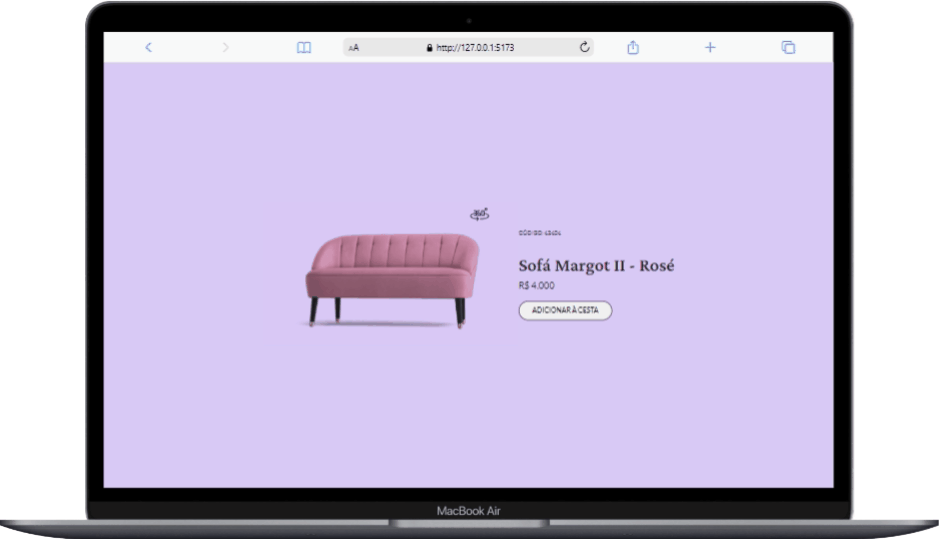

<h1 align="center">
    
</h1>

<br>

## 🛠 Tecnologias
Projeto desenvolvido com as seguintes tecnologias:

- [React](https://reactjs.org)
- [TypeScript](https://www.typescriptlang.org/)

## 💻 Projeto
Desafio 02 do programa boracodar.dev da Rocketseat. O desafio era criar um card de produto.

## 🚀 Como executar
Clone o projeto e acesse a pasta do mesmo.
### No Git Bash dê o comando:
git clone https://github.com/carlosdaniel31/card-produto.git<br>

Em seu editor na pasta do projeto dê os comandos:<br>
```npm install```<br>
```npm run dev```<br>
Acesse o local disponível
